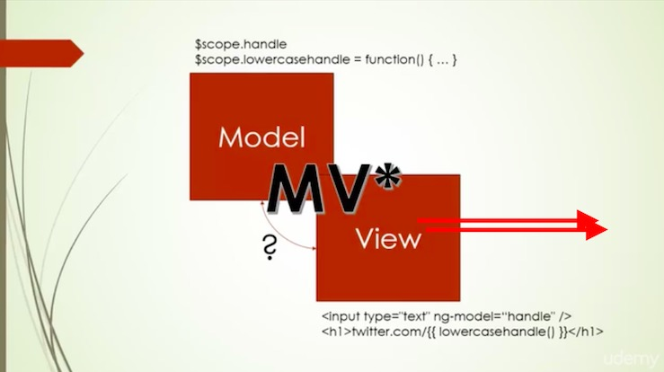

# Directives and Two Way Data Binding
+ ng-controller and ng-app are also directives
+ ng-model directive

ng-model means you want a specific variable bound to the scope

## Big Word
**Directive: An instruction to AngularJS to manipulate a piece of the DOM.**

This could be 'Add A Class', 'Hide This', 'Create This', ETC.

## Two Way Binding

