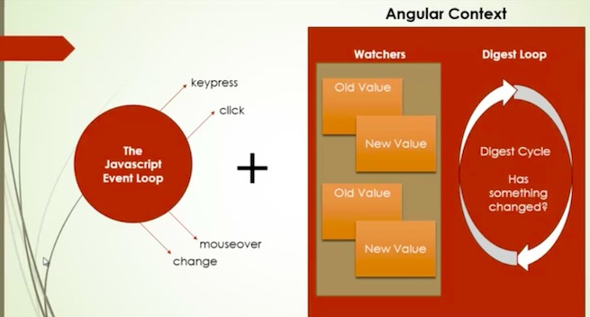
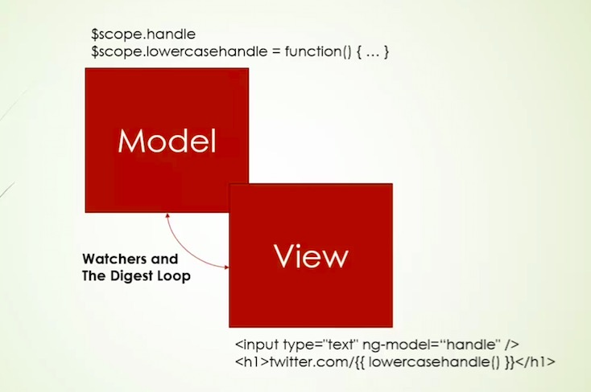

# Watchers and the Digest Loop


## Event loop
+ Angular context
+ Watchers
+ Angular saw ng-model to add these varibles and functions to the watcher/watch list, when an natual JS event happens, it runs the digest loop
to and cycle through all values to see if a value has change
+ More on JS event loop, check out a youtube video on this subject





## Add our own watch code to a specific variable
+ You don't have to do this under most circumstances

```
$scope.$watch('handle', function(newValue, oldValue){
  //when digest loop is running and see this value changes,
  //it will pass the old and new value to this callback function.
    console.info('Changed!');
    console.log('Old:' + oldValue);
    console.log('New:' + newValue);
  });

```


## One bad thing, it only watches things happening within the Angular context


## How to fix that
+ use $apply
+ If you use other libaray like jQuery, then you'll need apply
+ You can also use $timeout service

```
setTimeout(function(){
  // it change the scope, but angular didn't check for it
  // it didn't realise this change because it's outside of
  // angular js context
  // it never start the digest loop


  $scope.$apply(function(){
    $scope.handle = 'newsjgirjigjri';
    console.log('scope changed');
  });


},3000);


```



